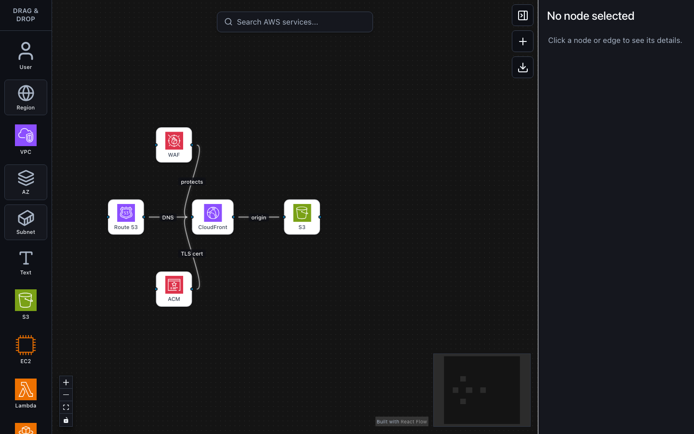

# AWS Architecture Drafts

[](https://app.netlify.com/projects/cloudish/deploys)

Herramienta visual para hacer drafts de arquitecturas en AWS. Sirve para bajar rapidamente una idea a un canvas, y exportar un primer scaffold de infraestructura.

Demo: <https://cloudish.netlify.app/>

Este proyecto fue construido como un experimento de **vibe coding** con agentes de IA, principalmente **Codex** y **Claude**. La intencion no es presentar una herramienta de produccion terminada, sino explorar que tan lejos se puede llegar iterando con agentes sobre una app real: UI, estado, drag-and-drop, reglas de jerarquia, exportadores y documentacion.



## Para Que Sirve

AWS Architecture Drafts esta pensado para etapas tempranas de diseño:

- Bocetar una arquitectura antes de escribir IaC.
- Probar distribuciones de servicios dentro de Region, VPC, AZ y Subnet.
- Explicar flujos entre servicios AWS con nodos y conexiones.
- Armar diagramas livianos para conversar decisiones tecnicas.
- Generar un punto de partida en Terraform o CloudFormation para revisar y completar.

No reemplaza una herramienta formal de diagramacion, discovery cloud o gestion de infraestructura. Es un POC para pensar arquitecturas con rapidez.

## Features

- Canvas interactivo construido con React Flow.
- Nodos para servicios AWS frecuentes como S3, EC2, Lambda, RDS, DynamoDB, CloudFront, API Gateway, IAM, CloudWatch y SQS.
- Herramientas para agregar usuario externo, regiones, VPCs, zonas de disponibilidad, subredes y notas de texto.
- Sidebar drag-and-drop y tambien click-to-add para sumar elementos al canvas.
- Buscador de servicios AWS para agregar componentes sin recorrer toda la lista.
- Inspector lateral para editar propiedades del nodo o conexion seleccionada.
- Edicion de labels en nodos, notas de texto y edges.
- Jerarquia de red modelada como `Region -> VPC -> AZ -> Subnet -> servicios`.
- Reparenting automatico al arrastrar nodos dentro de contenedores validos.
- Dropzone visual para indicar cuando un contenedor puede recibir un nodo.
- Auto-subdivision de contenedores: regiones en VPCs, VPCs en AZs y AZs en subredes.
- Recalculo de tamanos cuando se redimensionan contenedores padre.
- Sincronizacion de AZs para replicar subredes y servicios entre zonas hermanas.
- MiniMap, zoom, pan y controles nativos de React Flow.
- Exportacion a Terraform (`.tf`) y CloudFormation (`.yaml`) como scaffolds.
- Interfaz internacionalizada en ingles y espanol.
- Tema visual con variables CSS y modo oscuro automatico.

## Instalacion

Requisitos recomendados:

- Node.js 20 o superior.
- npm.
- [Netlify CLI](https://docs.netlify.com/cli/get-started/) para desarrollo local con las funciones del servidor.

Clonar el repositorio e instalar dependencias:

```bash
git clone <repo-url>
cd poc-react-flow
npm install
```

### Variables de entorno

Copiar `.env.example` a `.env.local` y completar los valores:

```bash
cp .env.example .env.local
```

| Variable | Descripcion |
| --- | --- |
| `VITE_FIREBASE_*` | Configuracion del SDK de Firebase para el cliente |
| `FIREBASE_SERVICE_ACCOUNT_JSON_BASE64` | Service account de Firebase Admin en base64 (solo servidor) |

### Desarrollo local

Para levantar la app **con las Netlify Functions** (guardado de arquitecturas, auth server-side):

```bash
netlify dev
```

Netlify CLI inicia Vite y las funciones juntos, y expone todo en `http://localhost:8888`.

Si solo se trabaja en el canvas sin necesitar las funciones del servidor, se puede usar:

```bash
npm run dev
```

Vite mostrara una URL local, normalmente `http://localhost:5173/`. Las llamadas a `/api/architectures` daran 404 en este modo.

## Scripts

```bash
netlify dev
```

Inicia la app con Vite y las Netlify Functions juntos (modo recomendado).

```bash
npm run dev
```

Inicia solo el frontend con Vite (sin funciones del servidor).

```bash
npm run build
```

Compila TypeScript y genera el build de produccion.

```bash
npm run lint
```

Ejecuta ESLint sobre el proyecto.

```bash
npm run preview
```

Sirve localmente el build generado.

## Como Usarlo

1. Arrastra servicios o contenedores desde la barra lateral al canvas.
2. Conecta nodos usando los handles de React Flow.
3. Selecciona un nodo o edge para editarlo desde el inspector.
4. Usa contenedores de red para ordenar la arquitectura por Region, VPC, AZ y Subnet.
5. Ajusta el numero de VPCs, AZs o subredes desde el inspector cuando corresponda.
6. Exporta el draft a Terraform o CloudFormation cuando quieras un scaffold inicial.

## Modelo De Red

La app usa una jerarquia inspirada en topologias AWS:

```text
Region -> VPC -> AZ -> Subnet -> servicios
```

Los contenedores validan donde puede vivir cada elemento. Por ejemplo, una VPC puede estar dentro de una Region, una AZ puede estar dentro de una VPC o Region, y una Subnet puede estar dentro de una AZ o VPC. Los servicios pueden ubicarse dentro de cualquier contenedor.

Cuando se arrastra un nodo dentro de un contenedor valido, la app actualiza automaticamente su parent y recalcula la posicion relativa. Esto permite mover partes del diagrama sin corregir manualmente la estructura.

## Exportacion

El exportador genera archivos de referencia:

- Terraform (`.tf`)
- CloudFormation (`.yaml`)

Estos archivos son scaffolds generados desde el canvas. Deben revisarse antes de aplicarse en cualquier entorno real: reemplazar placeholders, validar nombres, permisos, redes, dependencias, costos e impacto operativo.

## Stack Tecnico

- React 19
- TypeScript
- Vite
- `@xyflow/react`
- Zustand
- Tailwind CSS
- Radix UI
- Lucide React

## Estado Del Proyecto

Es un POC en evolucion. El foco esta en experimentar con la experiencia de diseñar arquitecturas cloud asistidas por agentes de IA, manteniendo el codigo suficientemente modular para seguir iterando:

- Componentes en `src/components`
- Datos estaticos en `src/data`
- Helpers compartidos en `src/lib`
- Tipos compartidos en `src/types`
- Traducciones en `src/i18n.ts`
